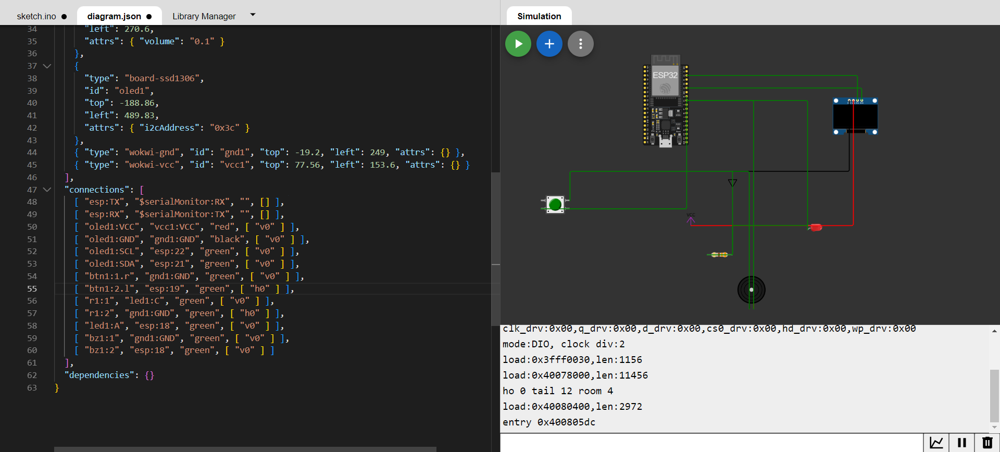

# EmbeddedProject
Dinogame with esp32
Link wowki: https://wokwi.com/projects/383207163259064321

# Giới thiệu
Trò chơi khủng long Dino (Google Chrome Dinosaur Game), được biết đến khi không có kết nối Internet trên trình duyệt Chrome. Trò chơi bao gồm một chú khủng long nhảy qua các chướng ngại vật xuất hiện ngẫu nhiên (cây).  Người chơi cần tránh va chạm với các vật thể, và điểm số sẽ tăng theo thời gian chơi.

* Luật chơi:
    
    * Khủng long bắt đầu ở một vị trí cố định và nhảy khi nút được nhấn.
    * Cây xuất hiện ở các khoảng thời gian ngẫu nhiên, và người choi phải nhảy qua để tránh va chạm
    * Điểm số tăng khi người chơi thành công tránh được cây
    * Trò chơi kết thúc khi khủng long va chạm với cây
    * Điểm số cao nhất được lưu trữ
# Tổng quan
## Các linh kiện chính
* ESP32
* Màn hình OLED SSD1306
* Đèn LED
* Nút nhấn
* Loa bíp

## Thư viện cần thiết
* Wire.h
* Adafruit_GFX.h
* Adafruit_SSD1306.h
* EEPROM.h

## Hướng dẫn kết nối
* Màn hình SSD1306: Kết nối vào các chân 21 và 22 của Arduino (SDA và SCL)
* Nút nhấn: Kết nối vào chân 19 của Arduino
* Đèn LED: Kết nối vào chân 2 của Arduino
* Loa: Kết nối vào chân 18 của Arduino

## Sử dụng
1. Kết nối các linh kiện theo hướng dẫn kết nối
2. Tải code lên bo mạch Arduino
3. Nhấn nút để bắt đầu trò chơi
4. Sử dụng nút để khủng long nhảy và tránh các cây
5. Trò chơi kết thúc khi khủng long va chạm, và điểm số cao nhất được lưu trữ

## Các hàm
* **Setup:** Khởi tạo màn hình, EEPROM và cấu hình chân, hiển thị thông điệp ban đầu
* **Loop:** Kiểm tra nút nhấn để bắt đầu trò chơi
* **Functions:**
    
    * **Play:** Hàm chính của trò chơi xử lý vòng lặp gameplay
    * **CheckButton:**  Kiểm tra nút nhấn có được bấm hay không
    * **MoveDino:** Hiển thị khủng long ở vị trị cụ thể
    * **MoveTree:** Hiển thị cây ở các vị trí ngẫu nhiên
    * **DisplayScore:** Hiển thị điểm số hiện tại trong khi chơi
    * **GameOver:** Hiển thị màn hình kết thúc trò chơi với điểm số cuối cùng và điểm số cao nhất

# Chi tiết
## Cấu hình các phần tử trong trò chơi
* Định hình khủng long
```javascript
static const unsigned char PROGMEM dino1
```
* Định hình cây loại 1
```javascript
static const unsigned char PROGMEM tree1
```
* Định hình cây loại 2
```javascript
static const unsigned char PROGMEM tree2
```
* Màn hình bắt đầu
```javascript
static const unsigned char PROGMEM trex
```
* Màn hình kết thúc
```javascript
static const unsigned char PROGMEM trexcry
```

## Chi tiết các hàm
```javascript
void setup(){...}
```
**Serial.begin(9600);** Bắt đầu kết nối serial với tốc độ truyền dữ liệu 9600 baud

**EEPROM.begin(512);** Khởi tạo EEPROM với dụng lượng 512 byte. EEPROM được sử dụng để lưu trữ thông tin khi bo mạch bị ngắt nguồn

**highest_score = EEPROM.read(0);** Đọc điểm số cao nhất từ địa chỉ 0

**pinMode();** cấu hình các chân

**display.clearDisplay();** Xóa bộ nhớ đệm của màn hình

**introMessage();** Hiển thị thông điệp/hình ảnh

```javascript
void loop(){...}
```
Kiểm tra nút nhấn để bắt đầu trò chơi

```javascript
void music_die(){...}
```
Âm thanh khi kết thúc trò chơi

```javascript
void introMessage(){...}
```
Hiển thị các thông báo trên màn hình

```javascript
int checkButton(){...}
```
Điều khiển đèn LED và loa

```javascript
display.drawBitmap(DINO_INIT_X, *y, dino1, DINO_WIDTH, DINO_HEIGHT, SSD1306_WHITE);
```

**DINO_INIT_X:** Vị trí ngang ban đầu của dino

***y:** Vị trí dọc của dino, được tham chiếu thông qua con trỏ '**y**'

```javascript
void moveTree(int16_t *x, int type = 0){...}
```
Xác định cây sẽ được vẽ lên màn hình tại vị trí ngang được xác định bởi giá trị của con trỏ '**x**'. Hai loại cây **tree1** và **tree2** có thể có kích thước khác nhau

```javascript
void gameOver(int score = 0){...}
```
Hiển thị thông tin khi kết thúc trò chơi
```javascript
void displayScore(int score)
```
Hiển thị điểm

```javascript
void play(){...}
```

```javascript
void renderScene(int16_t i = 0){...}
```
Hiển thị các đối tượng